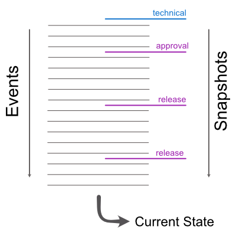

# matrix

ODIN/NIDO ist bisher auf die lokale Bearbeitung der Daten beschränkt. Die einzige Möglichkeit diese Daten auszutauschen ist der Export und Re-Import von Layern oder Projekten. 

Mit ODIN v2 soll die Möglichkeit geschaffen werden, sowohl kollaborativ in Echtzeit zusammen zu arbeiten als auch den für die Stabsarbeit typischen Arbeitsablauf (Freigaben, ...) abzubilden. Als technisches Vehikel für die Replikation haben wir das [Matrix](https://matrix.org) Ökosystem ausgewählt, da es so wie ODIN Open Source ist und aus jetziger Sicht alle grundsätzlichen Anforderungen erfüllen kann.

Für die Replikation von Daten verwenden wir die Spezifikation für das __Messaging__. Das bedeutet, dass lokale Änderungen an ODIN Objekten als _Nachricht_ in einem _Raum_ publiziert werden. Andere Kommunikationspartner können diese Nachrichten lesen und die darin enthaltenen Daten/Anweisungen interpretieren, um das betroffene ODIN Objekt in den selben Zustand wie das Original zu bringen.

In seiner allgemeinsten Form ist die Replikation als _jeder-mit-jedem_ zu sehen. Erweiterte bzw. einschränkende Anforderungen wie z.B. _einer-an-alle_ werden über die Berechtigungskonzepte von Matrix abgebildet.

## Elemente

In ODIN verwenden wir Projekte und Layer um Daten zu strukturieren. Diese Konzepte wollen wir auch bei der Replikation beibehalten und müssen entsprechende Analogien aus der Matrix welt dafür finden.

### Projekt

Ein Projekt in ODIN ist ein Container, in dem eine beliebige Anzahl von Layern und Einstellungen wie z.B. die verwendeten Basiskarten zusammengefasst sind.

### Layer

Ein Layer ist ein Container für eine beliebige Anzahl von Features.

### Feature

Ein Feature ist ein darstellbares und geographisch verortetes Objekt. Jedem Feature sind ein oder mehrere Geometrien und eine Menge von Eigenschaften zugeordnet.

## Abbildungen

Das primäre Container Element in Matrix ist der _Raum_. Mit der aktuellen Spezifikation (nov21) ist es möglich, Räume in hierarchische Strukturen zu unterteilen. Sogenannte _Spaces_ sind Räume, die wiederum Räume als Kind-Elemente enthalten können.

Die Abbildung ODIN <-> Matrix sieht wie folgt aus:

  * Projekt <-> Raum (Space)
  * Layer <-> Raum (Kind-Element des Raums, der als Space ausgewählt wurde)

## Matrix Referenz

Leider gibt es in der offiziellen Doku noch keine Abschnitte zum Thema _Spaces_. Allerdings existiert ein [Proposal for "spaces"](https://github.com/matrix-org/matrix-doc/blob/old_master/proposals/1772-groups-as-rooms.md), aus dem sich die wichtigsten Abläufe und Events ableiten lassen.

## Nachrichten

ODIN Features werden nicht explizit übertragen. In den einlenen Layern zugeordneten Räumen werden die internen vom Store aggregierten Kommandos als Nachrichten publiziert. Bei bestimmten Aktionen wie beispielswiese die Freigabe eines Planes oder Anforderung zur Absegnung eines Planes durch den Komandanten werden Snapshots der entsprechenden Layers verschickt. 

### Aufbau 

Jede Nachricht enthält mindestens einen Nachrichtentyp, einen Raum und die Payload.

### Nachrichtenstrom

Die Nachrichten werden entsprechen dem Event Sourcing Ansatz zeitlich geordnet abgelegt und aggregiert zu Snapshots aggregiert. Für Aktionen wie die Freigabe eines Plans werden ähnlich den Tags im Git Workflow  Snapshots erzeugt. Diese Snapshots können nicht verändert werden. Weiterführende Änderungen – wiederum als Events zeitlich geordnet abgelegt – beeinflussen bestehende Snapshot nicht.  

Um den benutzen Speicherplatz bei Bedarf zu begrenzen, können einzel Events zu einem technischen Snapshot aggregiert un archiviert werden.  

Snapshot können fachlich - Freigabe - oder technisch - Archivierung - motiviert sein. 

##

